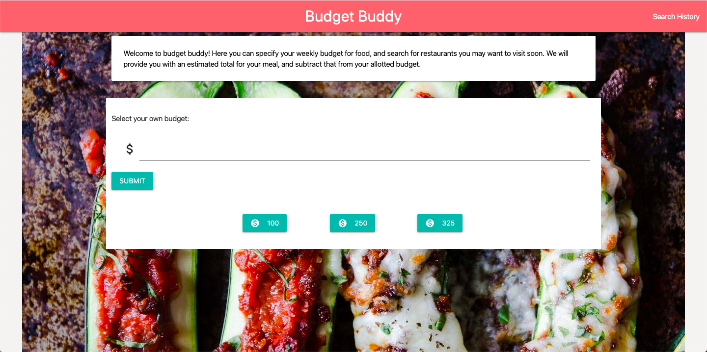
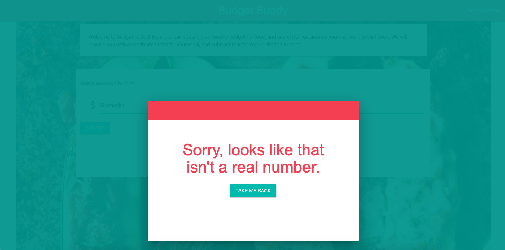
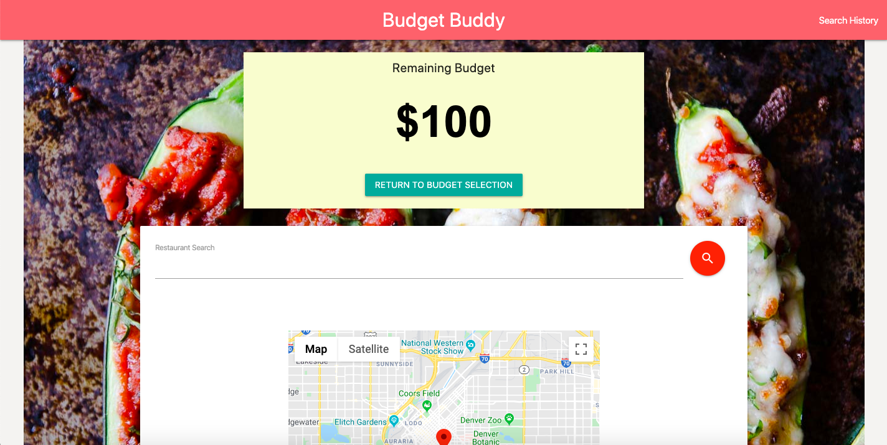
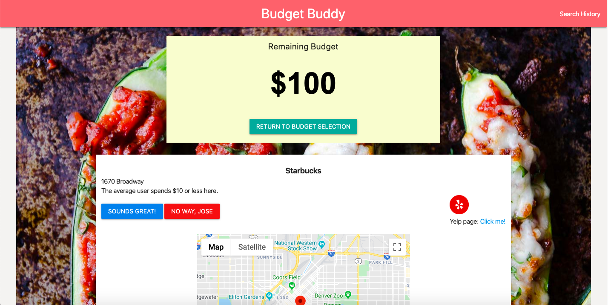
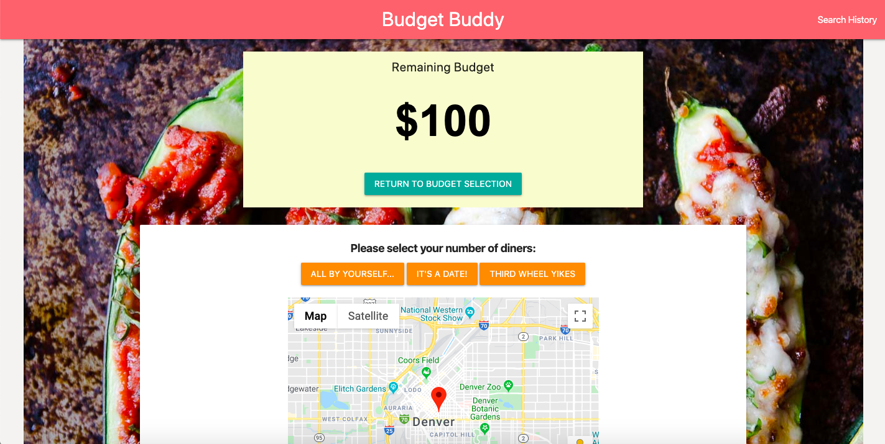
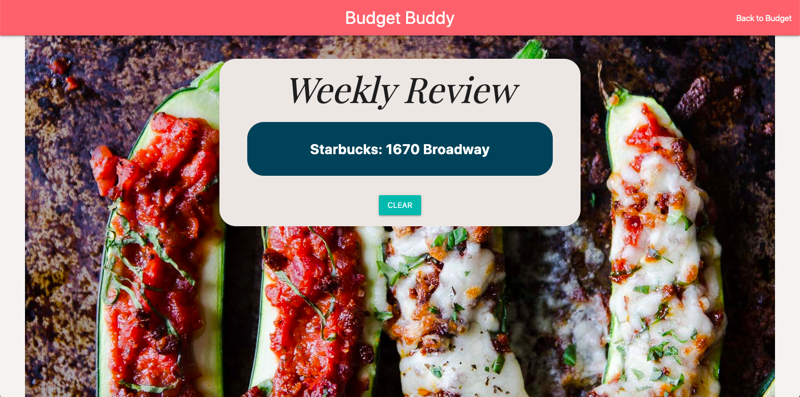

# Budget Buddy

v.1.0

## About

This app is a tool which allows our users to a.) anticipate how much they might spend at a particular restaurant and b.) Deduct that amount from a user-decided set budget.

As a YOUNG, HUNGRY PROFESSIONAL ON A BUDGET I would like to SEARCH NEARBY RESTAURANTS in my price range so that I DON'T GO OVER BUDGET by eating out.

Primary features:

-Upon loading, user is able to choose budget.  Until electing to return to the landing page, this amount will be saved in local storage.
-User is able to search for a restaurant, using the Yelp API for search results and the Google Maps API to view that restaurant's location on a map.
-User can view information on that restaurant and use that knowledge to decide whether they would like to add that location to their budget for the week.
-Each restaurant added to their budget is stored in local storage for later retrieval.
-User can choose how many diners they expect to be paying for, and the program will calculate the total they should anticipate paying.
-At any time, the user can go to their search history page and view the restaurants they have previously selected, with the option to clear out their local storage if they would like.

This website is mobile responsive and fully functional at any screensize.

## Screenshots

## Technology

CSS
HTML
JavaScript
Jquery
Materialize
BPopup (popup cdn)
Yelp API
Google Maps API
Google font
Geolocation-db API

## Link

Yelp API:
[https://www.yelp.com/fusion](https://www.yelp.com/fusion)

Google Maps API:
[https://developers.google.com/maps/documentation/javascript/tutorial](https://developers.google.com/maps/documentation/javascript/tutorial)

Bpopup CDN:
[http://dinbror.dk/bpopup/](http://dinbror.dk/bpopup/)

Free popup styling link:
[https://freefrontend.com/css-modal-windows/](https://freefrontend.com/css-modal-windows/)
[https://codepen.io/rauldronca/pen/QEraba/](https://codepen.io/rauldronca/pen/QEraba/)

Google Font:

[https://fonts.google.com](https://fonts.google.com)

Geolocation-db:

[https://geolocation-db.com/](https://geolocation-db.com/)

## Authors

Allison Bradley - github: @BestBroBradley
Nick Koch - github: @marauder30
Kyle Wilson-Kjellberg - github: @kyleawkjell
Spencer Davis - github: @SMDavis19